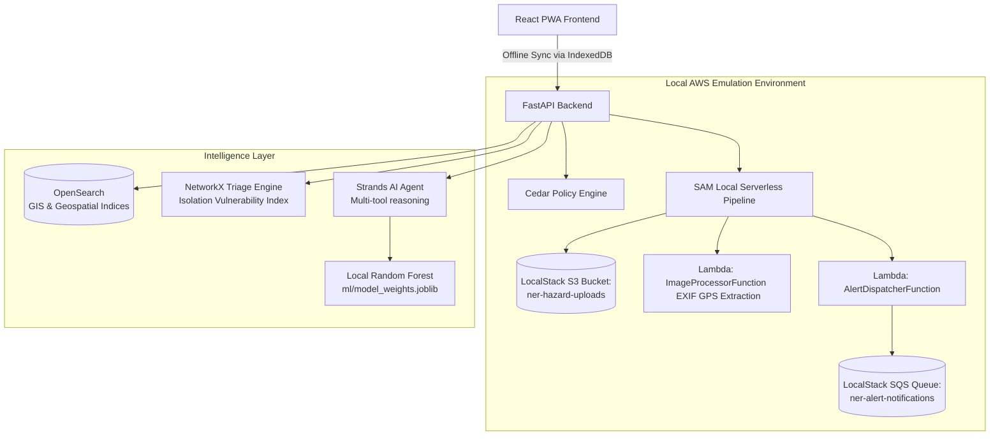

# NER Landslide Risk Monitoring & Early Warning System (NER-Landslide-Guard)

This project implements a localized, AI-enabled landslide risk monitoring and early warning platform designed specifically for the North Eastern Region (NER) of India. 

It directly addresses **MDoNER Problem Statement 26001** while adhering strictly to the **AWS "Build It" Track** requirements. The entire stack runs entirely offline, leveraging 100% open-source AWS tooling to ensure zero cloud bills and zero dependency on active internet connections—critical for remote areas of Nagaland, Sikkim, Meghalaya, and Mizoram during extreme weather.

## Architecture & AWS Open Source Stack

The system utilizes a dual-mode execution strategy, combining containerized edge deployment with local host fallbacks.



### AWS Open Source Stack Mapping

| Component | AWS Tool Used | Role in Solution |
| :--- | :--- | :--- |
| **Container Engine** | **Finch** / **EKS-D** | Local VM virtualization and container orchestration without Docker Desktop licensing. |
| **Serverless Emulation** | **LocalStack** & **AWS SAM CLI** | Emulates S3 (media uploads) and SQS (alert dispatching) locally. |
| **Spatial Database** | **OpenSearch** | Executes `geo_shape` and `geo_point` spatial queries to map hazard radii against critical infrastructure and road corridors (NH-29, NH-10). |
| **Authorization Engine** | **Cedar** (`cedarpy`) | Enforces Attribute-Based Access Control (ABAC) defining rules for Citizens, Field Inspectors, and District Officers locally. |
| **Autonomous AI** | **Strands Agent SDK** | Coordinates weather, satellite, and GIS queries autonomously via a local LLM, integrating with a deterministic RF heuristic fallback. |

## Quickstart & Local Reproduction

You can spin up the entire system with a single script. It automatically boots containers, verifies health, provisions S3/SQS, and seeds the geospatial OpenSearch indices.

**For Linux/macOS:**
```bash
chmod +x scripts/run_local_demo.sh
./scripts/run_local_demo.sh
```

**For Windows (PowerShell):**
```powershell
.\scripts\run_local_demo.ps1
```

Once running, access the dashboard at: **http://localhost:3000**

## Judging Demo Guide (3-Minute Walkthrough)

To quickly evaluate the solution for the hackathon, follow this script:

1. **Offline Queuing & Edge Resilience**: 
   - Open browser DevTools $\rightarrow$ Network $\rightarrow$ toggle **Offline**.
   - Use the *Hazard Report Form* to submit an image. 
   - Notice the report instantly caches to IndexedDB. The *Sync Status* pill in the navbar will turn grey ("Offline") and show a pending badge.
   - Toggle back to **Online** and click the Sync button to flush the queue to the backend.

2. **Cedar ABAC Live Testing**: 
   - Ensure the Role Switcher in the top navigation is set to **Citizen**.
   - Attempt to close a road by clicking "Close NH-29" in the bottom-right of the map. You will instantly receive a `403 Forbidden` alert.
   - Switch the Role to **DistrictOfficer** and click again. The action succeeds, and the road vector on the map instantly turns **red**.

3. **Triage Prioritization Engine**:
   - Once a road (like NH-29) is marked as BLOCKED, look at the *Triage Dashboard* panel on the right.
   - The NetworkX algorithm instantly recalculates severed graph edges, identifying isolated settlements (e.g., Zubza, Medziphema).
   - It computes an **Isolation Vulnerability Index (IVI)** based on population and days isolated, ranking rescue priority.

4. **Trilingual Alerts (Strands Agent)**:
   - The AI Agent generates localized emergency broadcasts automatically.
   - Use the language selector to switch between **English**, **Assamese (অসমীয়া)**, and **Bengali (বাংলা)**.
   - The entire dashboard UI dynamically renders contextual translations.
